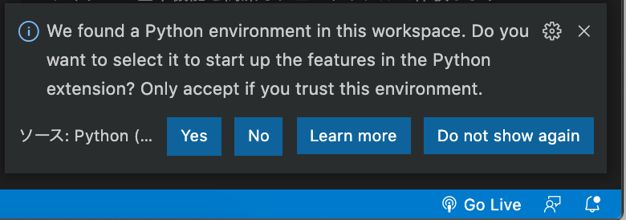
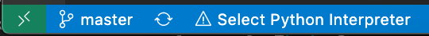
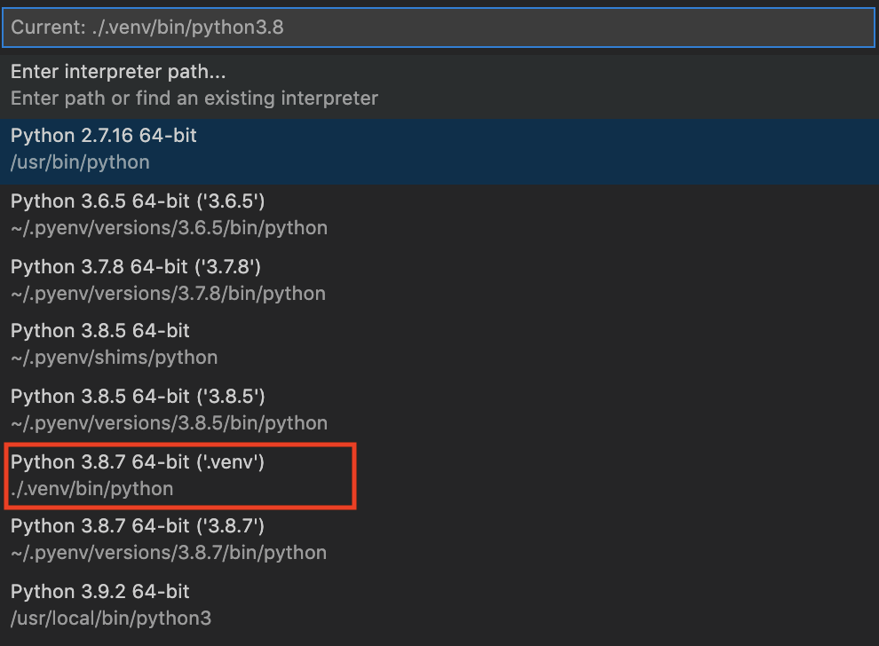
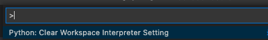

# Purpose

This repository is aimed to provide with Streamlit development environment template in VS Code.
Other IDEs like PyCharm are not supported but may run streamlit code.

Python is installed by `pyenv` into the project directory and packages are specified by `poetry`; this means you don't need to worry about inconsistency of developing environment.


Those python's linting and formating packages are installed by poetry dev dependency mode and vscode is controled at `./vscode/settings.json`, but you can change them as you like.

- mypy (just installed but type checking is mainly done by pyglance)
- flake8
- autopep8
- isort

Within the vscode terminal, .venv environment is recognized by `poetry shell` and adding package is done by `poetry add {package-name}` instead of `pip install {package-name}`.

## Prerequisites

- (Optional) Install [Visual Studio Code](https://code.visualstudio.com/download)
- Install `pyenv`
- Install `poetry`

### Install pyenv

On Mac OS (with Intel CPU is assumed), use `brew install`. On other OSs, see [official site installation](https://github.com/pyenv/pyenv#installation)

```sh
YOUR_SHELL_STARTUP_CONFIG="~/.`echo $SHELL | cut -f 3 -d '/'`rc"
# expected shell config file: ~/.bashrc for bash user, ~/.zshrc for zsh user
PY_VERSION=3.8.7

brew update
brew install pyenv
echo 'export PYENV_ROOT="$HOME/.pyenv"' >> $YOUR_SHELL_STARTUP_CONFIG
echo 'export PATH="$PYENV_ROOT/bin:$PATH"' >> $YOUR_SHELL_STARTUP_CONFIG
echo 'eval "$(pyenv init -)"' >> $YOUR_SHELL_STARTUP_CONFIG
exec $SHELL -l # reload
pyenv install $PY_VERSION # select No if already installed
```

### Install poetry

```sh
curl -sSL https://raw.githubusercontent.com/python-poetry/poetry/master/get-poetry.py | python -
```

Set shell completion. See [official site operation](https://python-poetry.org/docs/#enable-tab-completion-for-bash-fish-or-zsh)

## File structures

```sh
# tree -aL 2
.
├── .vscode
│   ├── extensions.json # recommendation of extensions
│   └── settings.json # linting and formatting settings
├── src
│   └── main.py       # entry point for streamlit
├── tests
│   ├── __init__.py
│   └── test_calc.py   # test example
├── .dockerignore      # for docker
├── .gitignore         # for git
├── .python-version    # specify python version by pyenv
├── docker-compose.yml # for docker
├── Dockerfile         # for docker
├── poetry.lock        # for poetry
├── poetry.toml        # for poetry
├── pyproject.toml     # for poetry
├── pyrightconfig.json # for VS Code pyright
├── pytest.ini         # for pytest
└── README.md          # this file

```

## First step from git clone

Make sure that pyenv and poetry are already installed before going ahead.

```sh
# DO this just in your default terminal, *NOT* in the vscode terminal,
# cd your-working-directory

git clone https://github.com/koizumihiroo/streamlit-vscode-template.git
cd streamlit-vscode-template

# only when pulling this repository first time
# $PY_VERSON=3.8.7 
# pyenv install $PY_VERSION 

# install python at local and packages specified by pyproject.toml
poetry install

# open vscode 
code .
```

## vscode settings

### Select vscode python interepter

This operation requires only when opening this repository (vscode directory) first time.

When opening vscode, the bottom-right popup message shows like below. Select `Yes`



Then, bottom-left bar shows `! Select Python Interprer`, click it, and select `./.venv/bin/python`





If above operations are not reproducible, open command palette by typing `F1` in your keyboard and enter `python: clear workspace interpretter setting` to reset your existing python path.



Then, in the bottom bar of vscode, select `./.venv/bin/python`.

Because vscode no-more provide `python.pythonPath` in your local settings, you need to manually select the python path. See [AB Experiments](https://github.com/microsoft/vscode-python/wiki/AB-Experiments).

In the vscode terminal, confirm the python path:

```sh
poetry shell
which python
# {your-working-directory}/streamlit-vscode-template/.venv/bin/python

$ poetry env list
# .venv (Activated)
```

Check if `pytest` runs completely

```sh
pytest
```

**NOTE**:

- When you want to add python packages, do `poetry add package-name`, do not `pip install package-name`.
- Do not forget typing `poetry shell` in the terminal

## Run own code in local

```sh
# poetry shell
streamlit run src/main.py 
# access 127.0.0.1:8501
```

## Debug

In vscode, set breakpoint by clicking arbitrary line number, which turn into a red point. Then the left side-bar of vscode, clicke debug icon and select `Python File`, debugging will be started/

## Run in docker

```sh
docker-compose up --build
# access 127.0.0.1:8501
```

## Test

```sh
# poetry shell
pytest
```
